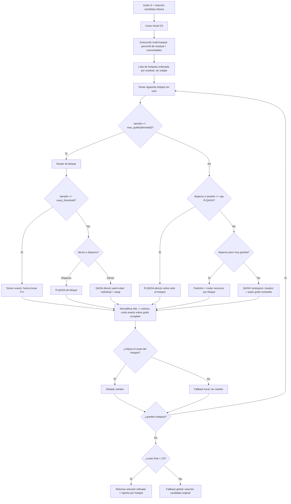

# Arquitectura del toolkit — transparencia del ruteo

Este documento explica, rombo por rombo, que decide el sistema en cada punto y por que. Cada
rombo del diagrama corresponde a una función nombrada en `toolkit/router.py` o
`toolkit/pipeline.py` — el reporte que imprime `toolkit/cli.py` anota, para cada corrida real, por
cuál rombo pasó y con qué números exactos (tamaño, densidad) se tomó la decisión, no solo el
resultado final.

## Diagrama de flujo completo

## Qué pasa en cada punto de decisión

| Rombo/paso | Función | Qué decide | Por qué |
|---|---|---|---|
| C | `evaluation/hotspots.py::extract_hotspots` | Detecta varios focos de conflicto (no solo el peor), por percentil de costo residual + comunidades (`greedy_modularity_communities`). | Una sola región por corrida (como en `poc-qaoa-agnostic-refinement`) deja pasar mejoras en otras zonas independientes del mismo grafo. |
| H | `router.py::decide_hotspot_route` | ¿El hotspot completo cabe en un solo circuito? El límite depende de la densidad (`max_qubits_sparse=14` vs. `max_qubits_dense=8`). | Justificado empíricamente en `hardware.py`/`Reporte_Tecnico_Kit.md`: bloques densos necesitan ~1.4-1.9× más compuertas de 2 qubits tras mapear a hardware real que bloques dispersos del mismo tamaño — el límite "seguro" es distinto según densidad. |
| J | `router.py::decide_hotspot_route` | Si no cabe pero es disperso y no demasiado grande (`<= max_qubits_rqaoa_direct=18`): R-QAOA directo sobre todo el hotspot, sin partición previa. | R-QAOA reduce dimensionalidad por su cuenta (elimina variables recursivamente); no necesita partición externa para grafos dispersos moderadamente grandes. |
| L | `router.py::decide_hotspot_route` | Si es disperso pero excede incluso ese límite: partición + router recursivo por bloque (`pipeline.py::_bisect_into_blocks`). | Último recurso para hotspots dispersos muy grandes — misma bisección balanceada (`kernighan_lin_bisection`) que ya usaba `qaoa_refine.py`. |
| — (rama densa) | `router.py::decide_hotspot_route` | Si es denso y no cabe: QAOA² jerárquico (clusters + super-grafo contraído) sobre todo el hotspot. | Es la pieza que le falta a la partición simple: reconcilia entre bloques en vez de resolverlos de forma aislada — ver `solvers/qaoa_square.py`. |
| N | `router.py::decide_block_solver` | Dentro de un bloque que ya cabe: ¿tamaño <= `exact_threshold=6`? | 2^6=64 combinaciones — fuerza bruta es más barata y más confiable que un circuito cuántico para esto, y sirve de oráculo de validación para los otros tres solvers. |
| P | `router.py::decide_block_solver` | Si no es trivial: disperso -> R-QAOA de bloque; denso -> QAOA directo warm-start. | Mismo criterio de densidad que a nivel-hotspot, aplicado a nivel-bloque. |
| (dentro de cada solver) | `qubo.py::build_alt_color_strategies` | Siempre se prueban las dos estrategias de candidato ("individual", "swap") contra la ruta elegida. | La estrategia "swap" fue necesaria para encontrar una mejora real en `poc-qaoa-agnostic-refinement` que "individual" sola no podía alcanzar (ver `docs/Diagnostico_DSATUR.md` de ese repo) — no hay razón para dejarla fuera del kit. |
| S | `pipeline.py::_try_block` | Decodifica los bits del solver a un coloreo completo y evalúa el costo **exacto** sobre el grafo completo — nunca la energía de Ising, que es solo la guía interna del optimizador cuántico. | Misma disciplina que `poc-qaoa-agnostic-refinement`: el costo real es la única fuente de verdad para aceptar o rechazar una propuesta. |
| T/U/V | `pipeline.py::refine` | Fallback local: si el hotspot no mejora, no se toca nada de esa región. | Cada hotspot se evalúa independientemente — uno que no mejora no bloquea a los demás. |
| X/Y/Z | `pipeline.py::refine` | Fallback global: si, sumando todos los hotspots, el costo total no bajó, se devuelve la solución candidata original sin ningún cambio. | Garantía de "nunca empeora" a nivel de la corrida completa, no solo por hotspot. |

## Los cuatro solvers, y cuándo gana cada uno

- **`exact`** (`solvers/exact.py`): fuerza bruta sobre el QUBO del bloque. Óptimo garantizado,
  gratis para `n <= 6`. También el oráculo de validación de los otros tres (ver
  `tests/test_toolkit.py`).
- **`direct_qaoa`** (`solvers/direct_qaoa.py`): QAOA con warm-start (Egger et al. 2021), portado
  de `poc-qaoa-agnostic-refinement`. Gana en bloques densos y moderados en tamaño — el ansatz
  captura bien las coordinaciones de 2 nodos (el patrón "swap") sin necesitar reducir
  dimensionalidad.
- **`r_qaoa`** (`solvers/r_qaoa.py`): eliminación recursiva por correlación cuántica (Bravyi et
  al. 2020). Gana en regiones dispersas o tipo cadena, donde la mejora real puede necesitar
  coordinar 3 o más nodos en secuencia — algo que ni `direct_qaoa` ni la estrategia "swap" (que
  solo mira un vecino a la vez) pueden alcanzar por diseño.
- **`qaoa_square`** (`solvers/qaoa_square.py`): partición en clusters + contracción a super-grafo
  (Zhou et al. 2023). Gana en regiones grandes y densas con estructura de comunidades reales —
  es la única ruta que reconcilia decisiones entre distintos sub-bloques de la misma región.

## El detalle que hace posible portar R-QAOA y QAOA² a *k* general

Ver `solvers/_ising_adapter.py` y `solvers/qaoa_square.py` (docstrings) para el desarrollo
completo. En una frase: la eliminación recursiva de R-QAOA y la contracción a super-grafo de
QAOA² son algorítmicamente genéricas (no le importa qué representa cada variable binaria); lo
único que asumía *k*=2 en el proyecto original (`QAOA-in-QAOA-Test/src/quantum/qaoa.py`) era la
función de costo de hoja (`compute_bitstring_cost`, "bit = color"), que aquí se reemplaza por la
energía de Ising directa sobre el QUBO por-nodo (`solvers/_qaoa_core.py::ising_energy`) — válida
para cualquier *k* porque en nuestra reducción el bit siempre significa "cambié al candidato
alternativo", nunca el color crudo.

## Qué no está al mismo nivel de validación

`exact` y `direct_qaoa` se cruzan contra fuerza bruta a escala real (mismo estándar que
`poc-qaoa-agnostic-refinement`). `r_qaoa` y `qaoa_square` se validan contra el oráculo `exact`
solo en bloques de juguete (`<=10` nodos) para confirmar que el adaptador de escala no tiene
signo o factor equivocado — no reciben todavía la misma investigación exhaustiva por fuerza bruta
a escala real que motivó la estrategia "swap". Ver `toolkit/README.md`.
